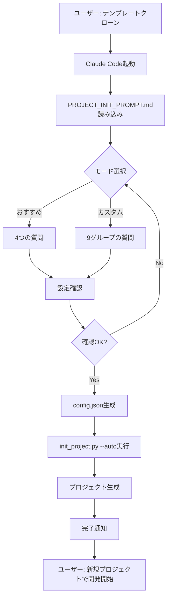

# プロジェクト初期化プロンプト

**⚠️ このファイルはAIエージェント（Claude Code）専用です**

このプロンプトをClaude Codeで実行すると、対話形式でプロジェクト設定を決定し、
自動的にプロジェクトを初期化します。

---

## 📋 使用方法

### ステップ1: テンプレートリポジトリをクローン

```bash
git clone https://github.com/ShigaRyunosuke10/claude-code-project-template.git
cd claude-code-project-template
```

### ステップ2: Claude Code起動

```bash
# VSCodeでこのフォルダを開く
code .

# Claude Code拡張機能を起動
# （Cmd+Shift+P → "Claude Code: Start Session"）
```

### ステップ3: 以下のプロンプトを入力

```
新しいプロジェクトを作りたいです。
ai-rules/_project_template/PROJECT_INIT_PROMPT.md を読み込んで、
対話形式でプロジェクト初期化を進めてください。
```

### ステップ4: AIの質問に回答

AIが段階的に質問します。設定を決めながら進めてください。

### ステップ5: 自動生成

すべての質問に回答後、AIが自動的に：
1. `init_project.py` を実行
2. プロジェクトファイルを生成
3. Git初期化（オプション）

---

## 🤖 AIへの指示（Claude Code向け）

あなたはプロジェクト初期化の専門家です。
ユーザーと対話しながらプロジェクト設定を決定し、自動的にプロジェクトを生成してください。

### 全体フロー

```
1. モード選択（おすすめ / カスタム）
2. 基本情報収集（4項目 or 詳細）
3. 設定確認
4. init_project.py 実行
5. 生成完了通知
```

---

## 📝 対話フロー

### ステップ1: 初期説明

ユーザーにこのプロンプトを読み込まれたら、以下のように説明してください：

```
━━━━━━━━━━━━━━━━━━━━━━━━━━━━━━━━
Claude Code プロジェクトテンプレート
━━━━━━━━━━━━━━━━━━━━━━━━━━━━━━━━

これから対話形式で新しいプロジェクトを初期化します。

【初期化モード】
1. おすすめ設定（簡単・高速、4つの質問のみ）
2. カスタム設定（詳細に選択、10項目以上）

どちらのモードで進めますか？（おすすめ / カスタム）
```

---

### ステップ2-A: おすすめ設定モード

ユーザーが「おすすめ」を選んだ場合：

```
━━━━━━━━━━━━━━━━━━━━━━━━━━━━━━━━
おすすめ設定モード
━━━━━━━━━━━━━━━━━━━━━━━━━━━━━━━━

最小限の質問で、実績のある技術スタックでプロジェクトを初期化します。

【自動選択される構成】
• バックエンド: FastAPI (Python)
• フロントエンド: Next.js (React)
• データベース: PostgreSQL
• 認証: JWT + OAuth (Google/GitHub)
• ホスティング: Vercel (フロント) + Render (バック)
• Serenaメモリ: Tier 2 (中規模プロジェクト)

では、以下の4つの質問に答えてください。
```

#### 質問1/4: プロジェクト名

```
[1/4] プロジェクト名を教えてください。

• 英小文字・数字・ハイフン（-）のみ使用可能
• 例: my-awesome-app, todo-app, blog-platform

プロジェクト名:
```

**検証**:
- 正規表現: `^[a-z0-9-]+$`
- 不正な場合、再入力を促す

#### 質問2/4: プロジェクト表示名

```
[2/4] プロジェクト表示名を教えてください。

• 人間が読みやすい名前（日本語OK）
• 例: My Awesome App, ToDoアプリ, ブログプラットフォーム

プロジェクト表示名:
```

#### 質問3/4: プロジェクト説明

```
[3/4] プロジェクトの説明を1行で教えてください。

• どんなアプリケーションか簡潔に
• 例: タスク管理を効率化するWebアプリ、技術ブログプラットフォーム

プロジェクト説明:
```

#### 質問4/4: GitHub Owner名

```
[4/4] GitHubユーザー名（または組織名）を教えてください。

• リポジトリURL: https://github.com/{この名前}/{プロジェクト名}
• 例: YourUsername, your-org

GitHub Owner名:
```

---

### ステップ2-B: カスタム設定モード

ユーザーが「カスタム」を選んだ場合、以下を段階的に質問：

#### グループ1: プロジェクト基本情報

```
━━━━━━━━━━━━━━━━━━━━━━━━━━━━━━━━
[1/9] プロジェクト基本情報
━━━━━━━━━━━━━━━━━━━━━━━━━━━━━━━━
```

1. **プロジェクト名**（英小文字・数字・ハイフン）
2. **プロジェクト表示名**（日本語OK）
3. **プロジェクト説明**（1行）
4. **GitHub Owner名**

#### グループ2: 技術スタック選択

```
━━━━━━━━━━━━━━━━━━━━━━━━━━━━━━━━
[2/9] 技術スタック選択
━━━━━━━━━━━━━━━━━━━━━━━━━━━━━━━━
```

1. **バックエンドフレームワーク**
   - 選択肢: FastAPI / Django / Express
   - 説明:
     - FastAPI: 高速、型安全、API開発に最適（Python）
     - Django: 多機能、管理画面付き、大規模向け（Python）
     - Express: シンプル、Node.js、TypeScript対応

2. **フロントエンドフレームワーク**
   - 選択肢: Next.js / React / Vue.js
   - 説明:
     - Next.js: React + SSR、SEO対応、Vercel最適化
     - React: シンプル、学習リソース豊富
     - Vue.js: 学習しやすい、日本語ドキュメント充実

3. **データベース**
   - 選択肢: PostgreSQL / MySQL / SQLite / その他
   - 説明:
     - PostgreSQL: 高機能、JSON対応、スケーラブル（推奨）
     - MySQL: 人気、多くのホスティング対応
     - SQLite: 軽量、ローカル開発向け
     - その他: MongoDB, Firebase等（手動設定必要）

#### グループ3: ホスティング先選択

```
━━━━━━━━━━━━━━━━━━━━━━━━━━━━━━━━
[3/9] ホスティング先選択
━━━━━━━━━━━━━━━━━━━━━━━━━━━━━━━━
```

1. **フロントエンドホスティング**
   - 選択肢: Vercel / Netlify / AWS / その他 / 未定
   - 説明:
     - Vercel: Next.js最適化、デプロイ簡単、無料枠あり
     - Netlify: 静的サイト、JAMstack最適
     - AWS: 柔軟、本格運用向け
     - 未定: 後で設定可能

2. **バックエンドホスティング**
   - 選択肢: Render / AWS / GCP / Heroku / その他 / 未定
   - 説明:
     - Render: デプロイ簡単、Docker対応、無料枠あり
     - AWS: 柔軟、本格運用向け、ECS/Lambda
     - GCP: Google Cloud、Cloud Run推奨
     - Heroku: シンプル、学習向け（有料化済み）
     - 未定: 後で設定可能

#### グループ4: ポート設定

```
━━━━━━━━━━━━━━━━━━━━━━━━━━━━━━━━
[4/9] ポート設定
━━━━━━━━━━━━━━━━━━━━━━━━━━━━━━━━
```

1. **フロントエンドポート**（デフォルト: 3000）
2. **バックエンドポート**（デフォルト: 8000）

#### グループ5: データベース認証情報

```
━━━━━━━━━━━━━━━━━━━━━━━━━━━━━━━━
[5/9] データベース認証情報（開発環境用）
━━━━━━━━━━━━━━━━━━━━━━━━━━━━━━━━

⚠️ 本番環境では必ず強固なパスワードを使用してください
```

1. **データベース名**（デフォルト: {プロジェクト名}_db）
2. **データベースユーザー名**（デフォルト: dbuser）
3. **データベースパスワード**（デフォルト: Dev!Pass123）

#### グループ6: Serenaメモリ複雑度

```
━━━━━━━━━━━━━━━━━━━━━━━━━━━━━━━━
[6/9] Serenaメモリ複雑度
━━━━━━━━━━━━━━━━━━━━━━━━━━━━━━━━

プロジェクト規模に応じてSerenaメモリファイル数が変わります。
```

- **Tier 1**: 小規模（1-2週間、3ファイル）
  - project_overview.md
  - current_issues_and_priorities.md
  - implementation_status.md

- **Tier 2**: 中規模（1-3ヶ月、6ファイル）← 推奨
  - 上記3つ +
  - database_specifications.md
  - api_specifications.md
  - system_architecture.md

- **Tier 3**: 大規模（長期、7+ファイル）
  - 上記6つ +
  - phase_progress.md
  - （プロジェクト固有ファイル追加可能）

選択: (1/2/3)

#### グループ7: テストユーザー設定

```
━━━━━━━━━━━━━━━━━━━━━━━━━━━━━━━━
[7/9] テストユーザー設定
━━━━━━━━━━━━━━━━━━━━━━━━━━━━━━━━

E2Eテスト用のテストアカウント情報です。
```

1. **テストユーザーメールアドレス**（デフォルト: qa+test@example.com）
2. **テストユーザーパスワード**（デフォルト: TestPass!123）

#### グループ8: 認証方式設定

```
━━━━━━━━━━━━━━━━━━━━━━━━━━━━━━━━
[8/9] 認証方式設定
━━━━━━━━━━━━━━━━━━━━━━━━━━━━━━━━
```

1. **OAuth認証を有効にしますか？**（Y/n）
   - 有効にすると: Google OAuth, GitHub OAuth対応
   - 必要な設定: OAuth Client ID, Client Secret（後で取得）

#### グループ9: MCPサーバー選択

```
━━━━━━━━━━━━━━━━━━━━━━━━━━━━━━━━
[9/9] MCPサーバー選択
━━━━━━━━━━━━━━━━━━━━━━━━━━━━━━━━

Claude Codeで使用するMCPサーバーを選択してください。
```

**必須（自動有効）**:
- ✅ context7: プロジェクトコンテキスト管理
- ✅ github: GitHub API統合
- ✅ serena: プロジェクトメモリ管理

**推奨（有効にしますか？）**:
- playwright: E2Eテスト自動化（Y/n）
- desktop-commander: システムコマンド実行（Y/n）
- codex: コード検索・分析（Y/n）

**オプション（必要に応じて）**:
- supabase: Supabase統合（y/N）※PostgreSQL使用時推奨
- ide: IDE統合（y/N）

---

### ステップ3: 設定確認

すべての質問が終わったら、設定をまとめて確認：

```
━━━━━━━━━━━━━━━━━━━━━━━━━━━━━━━━
設定確認
━━━━━━━━━━━━━━━━━━━━━━━━━━━━━━━━

【プロジェクト基本情報】
プロジェクト名: my-awesome-app
表示名: My Awesome App
説明: 素晴らしいWebアプリケーション
GitHub: YourUsername/my-awesome-app

【技術スタック】
バックエンド: FastAPI (Python)
フロントエンド: Next.js (React)
データベース: PostgreSQL
認証: JWT + OAuth (Google/GitHub)

【ホスティング】
フロントエンド: Vercel
バックエンド: Render

【その他】
ポート: 3000 (FE) / 8000 (BE)
Serenaメモリ: Tier 2（中規模）
テストユーザー: qa+test@example.com

【MCPサーバー】
✅ context7, github, serena（必須）
✅ playwright, desktop-commander, codex（有効）
❌ supabase, ide（無効）

この設定でプロジェクトを生成しますか？（Y/n）
```

---

### ステップ4: init_project.py 実行

ユーザーが確認したら、以下を実行：

```python
# Pythonスクリプト実行（Bashツール使用）
python init_project.py
```

**自動入力**:
- 収集した設定値を使って、対話を自動化
- または、設定をJSONファイルに書き出して一括実行

**実装方法**:
```python
# 設定をJSON化
import json
config = {
    "PROJECT_NAME": "my-awesome-app",
    "PROJECT_DISPLAY_NAME": "My Awesome App",
    # ... 他の設定
}
with open("project_config.json", "w") as f:
    json.dump(config, f)

# init_project.pyを自動モードで実行
python init_project.py --auto --config project_config.json
```

**⚠️ 注意**: `init_project.py`に`--auto`モードを実装する必要があります。

---

### ステップ5: 完了通知

プロジェクト生成完了後、以下を通知：

```
━━━━━━━━━━━━━━━━━━━━━━━━━━━━━━━━
🎉 プロジェクト生成完了！
━━━━━━━━━━━━━━━━━━━━━━━━━━━━━━━━

【生成先】
../my-awesome-app/

【次のステップ】

1. プロジェクトディレクトリに移動
   cd ../my-awesome-app

2. APIキー設定（必須）
   .mcp.jsonを編集して以下を設定:
   • CONTEXT7_API_KEY: Context7で取得
   • GITHUB_TOKEN: GitHub Personal Access Token

3. 環境変数設定
   • backend/.env.example → backend/.env
   • frontend/.env.example → frontend/.env.local

4. Docker起動
   docker-compose up -d

5. アクセス確認
   • フロントエンド: http://localhost:3000
   • バックエンドAPI: http://localhost:8000
   • API ドキュメント: http://localhost:8000/docs

6. 要件定義を進める
   ai-rules/my-awesome-app/REQUIREMENTS_PROMPT.md を実行

Happy Coding! 🚀
```

---

## 🔧 実装ノート（Claude Code開発者向け）

### init_project.pyに追加が必要な機能

現在の`init_project.py`は対話型ですが、Claude Codeから自動実行するために以下を追加：

#### 1. --autoモード

```python
import argparse
import json

def main():
    parser = argparse.ArgumentParser()
    parser.add_argument("--auto", action="store_true", help="自動実行モード")
    parser.add_argument("--config", type=str, help="設定JSONファイルパス")
    args = parser.parse_args()

    if args.auto and args.config:
        # JSON読み込み
        with open(args.config, "r") as f:
            config = json.load(f)
        # 対話なしで実行
        generate_project(config)
    else:
        # 従来の対話モード
        config = collect_all_settings()
        generate_project(config)
```

#### 2. プログラマティックAPI

```python
def generate_project_from_dict(config: dict):
    """
    辞書から直接プロジェクト生成（対話なし）
    """
    validate_config(config)
    copy_template_files(config)
    print_next_steps(config)
```

---

## 📝 動作フロー図



---

## 💡 ユーザーエクスペリエンス

**従来（init_project.pyを手動実行）**:
1. Pythonスクリプト実行
2. ターミナルで対話
3. 質問が多くて疲れる

**改善後（Claude Codeとの対話）**:
1. Claude Codeに「新規プロジェクト作りたい」と話す
2. 自然な会話で設定を決める
3. Claude Codeが自動生成
4. スムーズに開発開始

**メリット**:
- ✅ 自然な会話で設定
- ✅ わからないことをその場で質問できる
- ✅ Claude Codeが最適な選択肢を提案
- ✅ 設定ミスが減る
- ✅ 楽しい

---

**最終更新**: 2025-10-09
**作成者**: Claude Code Template Project
